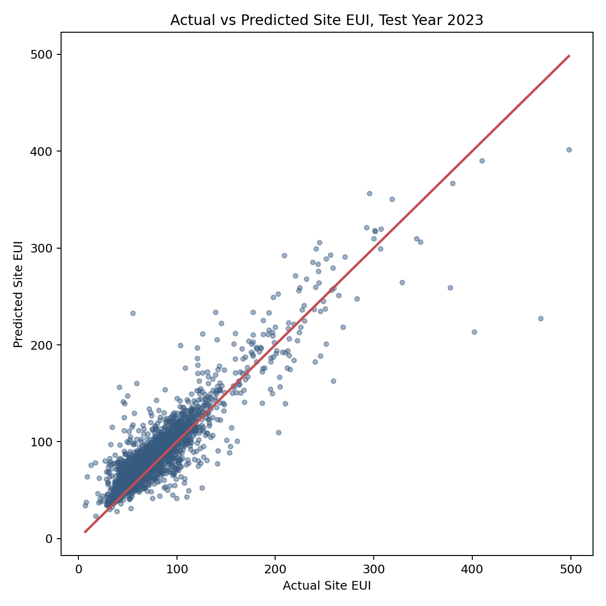
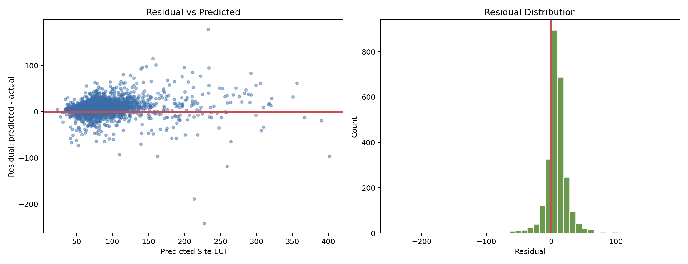
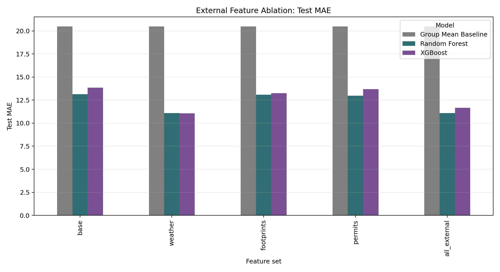
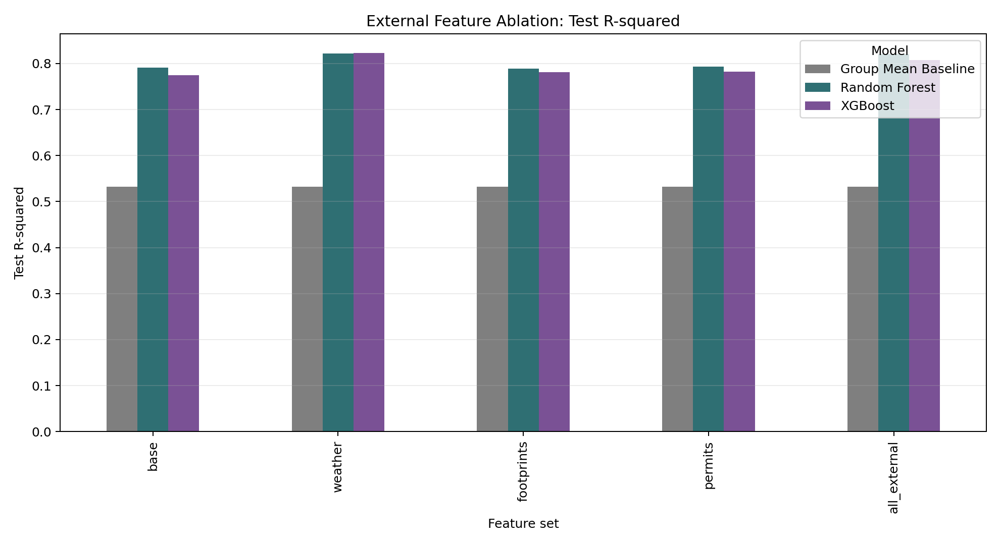
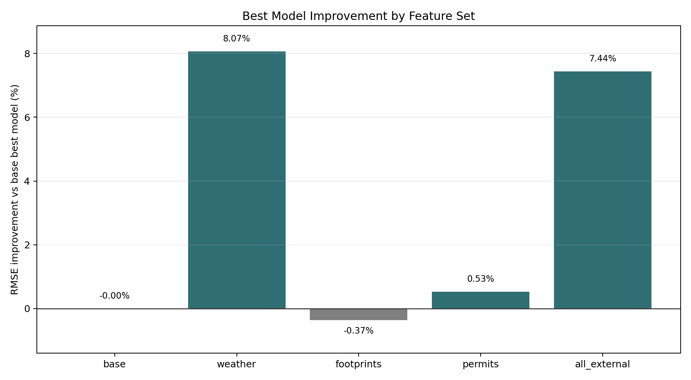
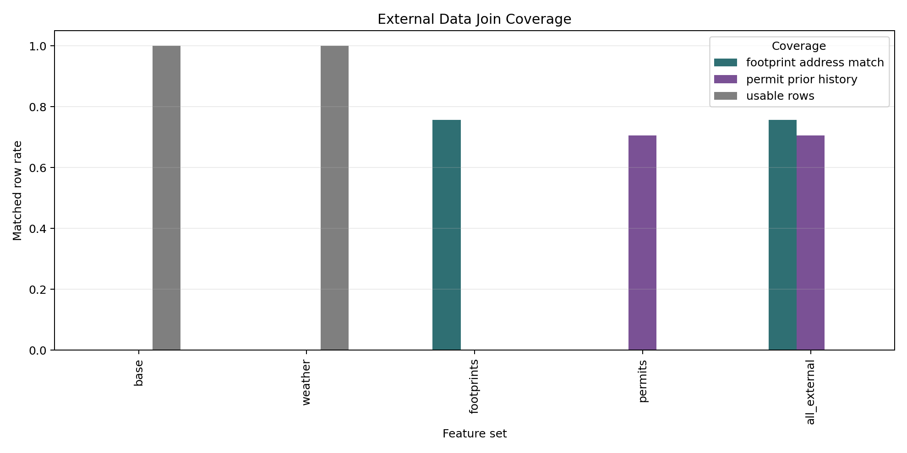

# Data Mining Group 8

**Predicting Building Energy Use Intensity in Chicago via Spatio-Temporal Data Mining**

This project predicts annual building-level `Site EUI (kBtu/sq ft)` using Chicago Energy Benchmarking data. The main task is a regression problem with a spatio-temporal unit of one `building-year` record.

## Project Scope

- Dataset: Chicago Energy Benchmarking
- Core range: 2018-2023
- Target: `site_eui_kbtu_sq_ft`
- Train: 2018-2021
- Validation: 2022, used for random search hyperparameter tuning
- Test: 2023, used only for final evaluation
- Metrics: RMSE, MAE, R-squared

## Repository Contents

- `model.py`: entry point for the original base workflow.
- `src/run_energy_benchmarking_analysis.py`: base data preprocessing, feature engineering, model training, tuning, evaluation, and outputs.
- `src/compare_external_features.py`: ablation comparison for weather, building footprints, and building permits.
- `src/run_all_external_feature_comparison.py`: runs the combined external feature set.
- `src/analyze_weather_subgroup_errors.py`: evaluates whether weather features reduce errors for high-EUI and special building types.
- `data/processed/`: cleaned modeling tables and processed weather features.
- `outputs/`: metrics, tuning results, predictions, feature importance, and group error analysis.
- `outputs/plots/`: visualizations used in reports.
- `reports/`: written reports and PDF summaries.

Document-generation Python scripts are intentionally not tracked. The generated reports are included.

## Base Model Results

The base model uses Chicago Energy Benchmarking fields plus engineered spatial, temporal, historical EUI, and building-level features.

| Model | Test RMSE | Test MAE | Test R-squared |
|---|---:|---:|---:|
| Random Forest | 19.4437 | 13.1277 | 0.7908 |
| XGBoost | 20.1889 | 13.8336 | 0.7745 |
| Ridge Regression | 22.2865 | 16.1149 | 0.7252 |
| Group Mean Baseline | 29.0747 | 20.4876 | 0.5323 |
| Global Mean Baseline | 43.3843 | 29.9623 | -0.0413 |





## External Feature Ablation

Three external data sources were tested individually and together:

1. Weather: annual temperature, precipitation, HDD/CDD, hot/cold days.
2. Building Footprints: footprint area, perimeter, compactness, stories, footprint age.
3. Building Permits: prior 3-year permit count, reported cost, HVAC/electrical/renovation permit indicators.
4. All external: weather + footprints + permits.

Each feature set was re-tuned with random search because adding external features changes the feature space.

| Feature Set | Best Model | Test RMSE | Test MAE | Test R-squared | RMSE Change vs Base |
|---|---|---:|---:|---:|---:|
| Base | Random Forest | 19.4437 | 13.1277 | 0.7908 | 0.00% |
| Weather | XGBoost | 17.8748 | 11.0647 | 0.8232 | -8.07% |
| Footprints | Random Forest | 19.5151 | 13.0831 | 0.7893 | +0.37% |
| Permits | Random Forest | 19.3409 | 12.9813 | 0.7930 | -0.53% |
| All External | Random Forest | 17.9975 | 11.0789 | 0.8208 | -7.44% |

The weather-only feature set performs best. Adding all external data still improves over the base model, but it does not outperform weather-only.










## Key Finding

The final recommended model is:

**Base features + Weather features + XGBoost Regressor**

This model achieved:

- Test RMSE: `17.8748`
- Test MAE: `11.0647`
- Test R-squared: `0.8232`

Weather features provide the strongest and most stable external predictive signal. Building footprint and permit features did not add stable value once weather features were included, likely due to address matching noise, data granularity, and missing operational information such as occupancy, operating hours, and HVAC system details.

## High-EUI and Special-Type Error Analysis

Weather features improved overall model performance and reduced error for several special building types, including Laboratory, Supermarket/Grocery Store, Hospital, Senior Living Community, and College/University. However, they did not fully solve the large-error problem for very high-EUI buildings.

| Subgroup | Base Best MAE | Weather MAE | Interpretation |
|---|---:|---:|---|
| EUI >= 100 | 18.947 | 18.729 | Small improvement |
| EUI >= 150 | 28.698 | 29.658 | Worse |
| EUI >= 200 | 35.586 | 37.536 | Worse |
| Laboratory | 53.676 | 50.426 | Improved |
| Supermarket/Grocery Store | 35.775 | 34.534 | Improved |
| Hospital | 15.550 | 14.460 | Improved |
| Senior Living Community | 17.282 | 13.620 | Improved |
| College/University | 15.449 | 12.607 | Improved |

## Reports

- [Main report](reports/chicago_energy_benchmarking_report.md)
- [External data ablation report](reports/external_data_ablation_report.md)
- [External data ablation PDF](reports/external_data_ablation_report.pdf)
- [Weather subgroup error analysis](reports/weather_subgroup_error_analysis.md)

## Reproduce

Install dependencies:

```bash
pip install -r requirements.txt
```

Run the base workflow:

```bash
python model.py
```

Run the external feature ablation:

```bash
python src/compare_external_features.py
python src/run_all_external_feature_comparison.py
python src/analyze_weather_subgroup_errors.py
```

Raw data is downloaded by scripts and is not tracked in Git.
