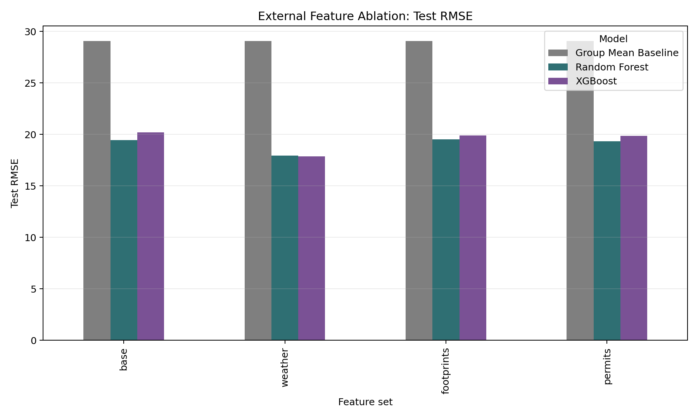

# External Feature Ablation Comparison

本補充實驗分別加入三種外部資料，觀察是否能提升 Chicago Energy Benchmarking 的 Site EUI regression model。

比較方式：

1. `base`：原始報告中的資料前處理與 feature engineering。
2. `weather`：加入年度天氣特徵，包括 HDD/CDD、平均溫度、降水、極端高溫/低溫天數。
3. `footprints`：加入 Chicago Building Footprints 的建築幾何與樓層特徵。
4. `permits`：加入 Building Permits 的前三年 permit history。

所有版本都使用同一個切分：

- Train：2018-2021
- Validation：2022，用於 random search hyperparameter tuning
- Test：2023，只做最後評估

## Join Coverage

| feature_set | matched_rows | matched_row_rate | matched_unique_addresses | unique_addresses | recent_permit_rows | recent_permit_row_rate |
| ----------- | ------------ | ---------------- | ------------------------ | ---------------- | ------------------ | ---------------------- |
| base        | 15177.0000   | 1.0000           |                          |                  |                    |                        |
| weather     | 15177.0000   | 1.0000           |                          |                  |                    |                        |
| footprints  | 11481.0000   | 0.7565           | 3085.0000                | 4248.0000        |                    |                        |
| permits     | 10706.0000   | 0.7054           |                          |                  | 9613.0000          | 0.6334                 |

## Test Metrics

| feature_set | model               | rmse    | mae     | r2     |
| ----------- | ------------------- | ------- | ------- | ------ |
| base        | Random Forest       | 19.4437 | 13.1277 | 0.7908 |
| base        | XGBoost             | 20.1889 | 13.8336 | 0.7745 |
| base        | Group Mean Baseline | 29.0747 | 20.4876 | 0.5323 |
| footprints  | Random Forest       | 19.5151 | 13.0831 | 0.7893 |
| footprints  | XGBoost             | 19.9053 | 13.2463 | 0.7808 |
| footprints  | Group Mean Baseline | 29.0747 | 20.4876 | 0.5323 |
| permits     | Random Forest       | 19.3409 | 12.9813 | 0.7930 |
| permits     | XGBoost             | 19.8375 | 13.6813 | 0.7823 |
| permits     | Group Mean Baseline | 29.0747 | 20.4876 | 0.5323 |
| weather     | XGBoost             | 17.8748 | 11.0647 | 0.8232 |
| weather     | Random Forest       | 17.9485 | 11.0946 | 0.8218 |
| weather     | Group Mean Baseline | 29.0747 | 20.4876 | 0.5323 |

## Best Model By Feature Set

| feature_set | model         | rmse    | mae     | r2     | rmse_change_vs_base_best | rmse_change_pct_vs_base_best |
| ----------- | ------------- | ------- | ------- | ------ | ------------------------ | ---------------------------- |
| base        | Random Forest | 19.4437 | 13.1277 | 0.7908 | 0.0000                   | 0.0000                       |
| footprints  | Random Forest | 19.5151 | 13.0831 | 0.7893 | 0.0714                   | 0.3670                       |
| permits     | Random Forest | 19.3409 | 12.9813 | 0.7930 | -0.1028                  | -0.5285                      |
| weather     | XGBoost       | 17.8748 | 11.0647 | 0.8232 | -1.5689                  | -8.0689                      |

## 圖表

## Interpretation

- 若 `rmse_change_vs_base_best` 為負值，代表該外部資料相對於 base 最佳模型有提升。
- 若為正值，代表加入該外部資料後 test RMSE 沒有改善，可能是資料 join coverage 不足、外部資料與 EUI 關係較弱，或新增特徵在 validation/test 年份間不穩定。
- Weather features 是年度層級，所有建築同一年拿到同一組天氣值，因此主要補充時間變異，不能補足建築間差異。
- Footprint features 屬於建築形狀與規模資訊，若地址 match coverage 高，理論上最有機會補強建築物理特性。
- Permit features 使用 reporting year 前三年的 permit history，避免使用未來資訊；若沒有提升，可能代表 permit 類型太粗、地址匹配不足，或 permit 對 EUI 的影響有時間延遲。
