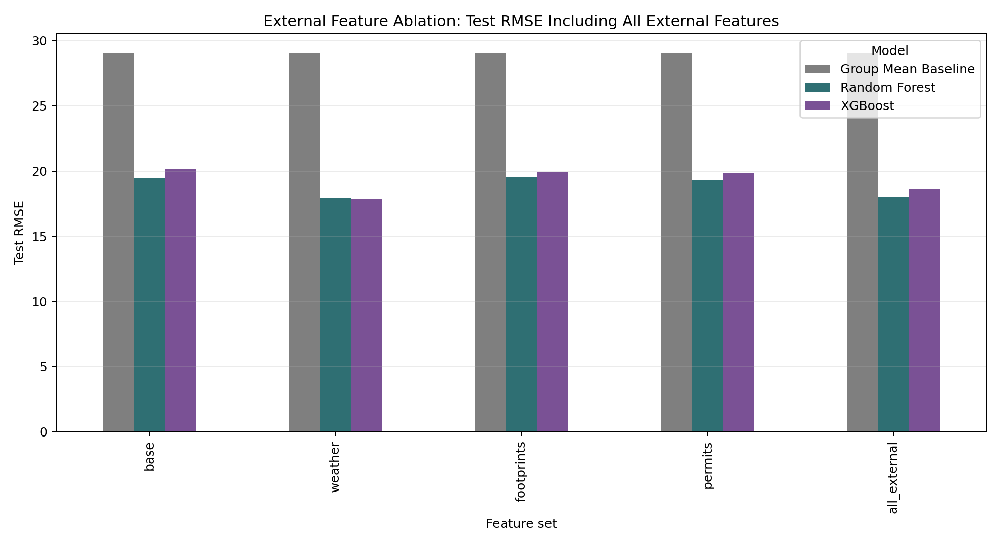

# External Feature Ablation Comparison With All External Features

本補充實驗在原本三個單獨外部資料比較之外，額外加入一組 `all_external`：

> Base + Weather + Building Footprints + Building Permits

所有版本都使用同一個切分與 tuning 設定：

- Train：2018-2021
- Validation：2022，用於 random search hyperparameter tuning
- Test：2023，只做最後評估
- Random Forest：20 組 random search
- XGBoost：25 組 random search

## Join Coverage

| feature_set  | matched_rows | matched_row_rate | matched_unique_addresses | unique_addresses | recent_permit_rows | recent_permit_row_rate | weather_matched_rows | weather_matched_row_rate | footprint_matched_rows | footprint_matched_row_rate | permit_matched_rows | permit_matched_row_rate |
| ------------ | ------------ | ---------------- | ------------------------ | ---------------- | ------------------ | ---------------------- | -------------------- | ------------------------ | ---------------------- | -------------------------- | ------------------- | ----------------------- |
| base         | 15177.0000   | 1.0000           |                          |                  |                    |                        |                      |                          |                        |                            |                     |                         |
| weather      | 15177.0000   | 1.0000           |                          |                  |                    |                        |                      |                          |                        |                            |                     |                         |
| footprints   | 11481.0000   | 0.7565           | 3085.0000                | 4248.0000        |                    |                        |                      |                          |                        |                            |                     |                         |
| permits      | 10706.0000   | 0.7054           |                          |                  | 9613.0000          | 0.6334                 |                      |                          |                        |                            |                     |                         |
| all_external | 15177.0000   | 1.0000           |                          |                  | 9613.0000          | 0.6334                 | 15177.0000           | 1.0000                   | 11481.0000             | 0.7565                     | 10706.0000          | 0.7054                  |

## Test Metrics

| feature_set  | model               | rmse    | mae     | r2     |
| ------------ | ------------------- | ------- | ------- | ------ |
| all_external | Random Forest       | 17.9975 | 11.0789 | 0.8208 |
| all_external | XGBoost             | 18.6474 | 11.6705 | 0.8076 |
| all_external | Group Mean Baseline | 29.0747 | 20.4876 | 0.5323 |
| base         | Random Forest       | 19.4437 | 13.1277 | 0.7908 |
| base         | XGBoost             | 20.1889 | 13.8336 | 0.7745 |
| base         | Group Mean Baseline | 29.0747 | 20.4876 | 0.5323 |
| footprints   | Random Forest       | 19.5151 | 13.0831 | 0.7893 |
| footprints   | XGBoost             | 19.9053 | 13.2463 | 0.7808 |
| footprints   | Group Mean Baseline | 29.0747 | 20.4876 | 0.5323 |
| permits      | Random Forest       | 19.3409 | 12.9813 | 0.7930 |
| permits      | XGBoost             | 19.8375 | 13.6813 | 0.7823 |
| permits      | Group Mean Baseline | 29.0747 | 20.4876 | 0.5323 |
| weather      | XGBoost             | 17.8748 | 11.0647 | 0.8232 |
| weather      | Random Forest       | 17.9485 | 11.0946 | 0.8218 |
| weather      | Group Mean Baseline | 29.0747 | 20.4876 | 0.5323 |

## Best Model By Feature Set

| feature_set  | model         | rmse    | mae     | r2     | rmse_change_vs_base_best | rmse_change_pct_vs_base_best | rmse_change_vs_weather_best | rmse_change_pct_vs_weather_best |
| ------------ | ------------- | ------- | ------- | ------ | ------------------------ | ---------------------------- | --------------------------- | ------------------------------- |
| all_external | Random Forest | 17.9975 | 11.0789 | 0.8208 | -1.4462                  | -7.4379                      | 0.1227                      | 0.6865                          |
| base         | Random Forest | 19.4437 | 13.1277 | 0.7908 | 0.0000                   | 0.0000                       | 1.5689                      | 8.7772                          |
| footprints   | Random Forest | 19.5151 | 13.0831 | 0.7893 | 0.0714                   | 0.3670                       | 1.6403                      | 9.1764                          |
| permits      | Random Forest | 19.3409 | 12.9813 | 0.7930 | -0.1028                  | -0.5285                      | 1.4661                      | 8.2023                          |
| weather      | XGBoost       | 17.8748 | 11.0647 | 0.8232 | -1.5689                  | -8.0689                      | 0.0000                      | 0.0000                          |

## 圖表

## Interpretation

Weather-only 的最佳模型是 **XGBoost**，test RMSE = **17.8748**。

All external 的最佳模型是 **Random Forest**，test RMSE = **17.9975**。

相對於 weather-only，all external 的 RMSE 變化為 **0.1227**，百分比為 **0.69%**。

若 all external 沒有優於 weather-only，代表 footprints 與 permits 在目前的 address matching、資料粒度與特徵設計下，沒有在 weather features 已存在時提供穩定額外訊息。若 all external 優於 weather-only，則表示建築幾何或 permit history 對 weather-adjusted model 還有額外補充價值。
